# Red user guide

Red is a desktop app for YouTube on Linux. This page walks through the window, playback, TV
mode, blocking, downloads and the settings, and ends with a troubleshooting section. You can
open it from inside the app at any time: the **⋯** menu on the side rail → **Online guide**, or
**About Red → Online guide**.

- [Install and first start](#install-and-first-start)
- [The window](#the-window)
- [Watching](#watching)
- [TV mode](#tv-mode)
- [Music mode](#music-mode)
- [Blocking](#blocking)
- [Downloads](#downloads)
- [Settings](#settings)
- [Keyboard shortcuts](#keyboard-shortcuts)
- [Command line](#command-line)
- [Troubleshooting](#troubleshooting)
- [Privacy](#privacy)

## Install and first start

**Snap** (amd64 and arm64):

```sh
sudo snap install red-app
```

**Flatpak** (x86_64 and aarch64), from [Flathub](https://flathub.org/apps/com.ktechpit.red):

```sh
flatpak install flathub com.ktechpit.red
```

On the first start of each new version Red shows a short *What's new* sheet; press **Got it**
or Esc to close it. The full history is in the [changelog](CHANGELOG.md).

## The window

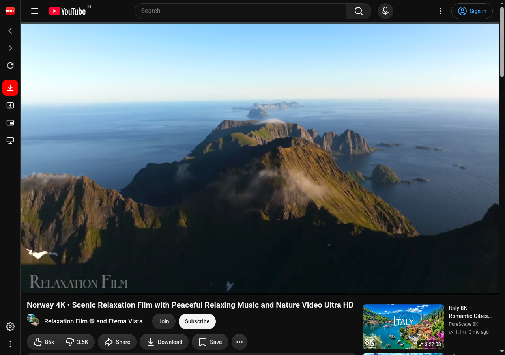

Red shows the YouTube site with a slim rail on the left. From top to bottom the rail has the
Red logo (**Home**), **Back**, **Forward** and **Reload**, then **Download this** (the current video, playlist or
channel), **Downloads** (opens the queue beside the page), **Mini player**, **TV mode**,
**Music mode**, and at
the bottom **Settings** and the **⋯** menu.

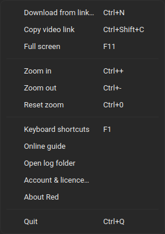

The ⋯ menu holds everything that is not on the rail: download from a pasted link, copy the
current video link, full screen, zoom, the keyboard shortcuts sheet, this guide, the log folder
and *About Red*. Every rail button has a shortcut (press **F1** for the list), and the rail can
be hidden in *Settings → General* if you prefer shortcuts alone.

## Watching

**Sign in** on YouTube exactly as you would in a browser: click *Sign in* on the page. Red
keeps the session between starts. Subscriptions, history and recommendations work as usual.

**Theme**: *Settings → Appearance* switches Red and YouTube together between light, dark and
the system theme. *Page zoom* changes YouTube's size, *Interface scale* changes Red's own
dialogs.

**Media keys** on the keyboard and the desktop's media controls (the sound applet, a
smartwatch, a Bluetooth headset) play, pause and skip. Red also appears as a player in the
desktop's media widget (MPRIS).

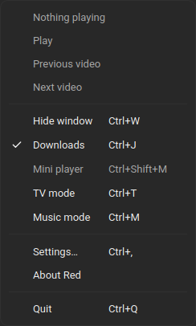

**Tray icon**: shows what is playing, with play / pause, previous and next. Closing the window
can either quit Red or leave it in the tray, still playing (*Settings → General → When closing
the window*). On GNOME the tray needs the *AppIndicator and KStatusNotifierItem Support*
extension.

**Mini player** (Ctrl+Shift+M, or the rail button) pops the current video into a small
always-on-top window while you work. It is available while a video plays; close it to return
to the main window. Its size is in *Settings → Playback*.

**Screen** stays awake while a video plays, and playback keeps going while the window is hidden
or minimised. Both are switches in *Settings → Playback*.

**Codec**: if playback uses too much CPU on an older machine, set *Preferred codec* to H.264 in
*Settings → Playback*. *Hardware decoding* (VA-API) offloads decoding to the GPU on machines
with a working driver; see [Troubleshooting](#troubleshooting) if video turns blank.

## TV mode

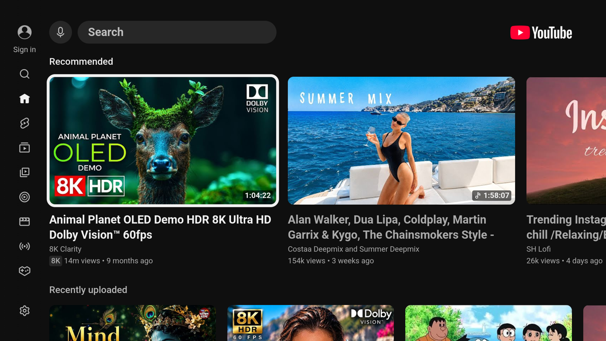

**Ctrl+T** (or the rail button) switches to YouTube's living-room interface, the one on smart
TVs and consoles, full screen by default. The video you were watching carries over, and so does
your sign-in. Ctrl+T switches back.

| Keys | Action |
|---|---|
| Arrows, Enter | Navigate, select |
| Esc, Backspace, right click | Back |
| Ctrl+T | Back to desktop mode |
| Ctrl+D | Download the current video |
| + / −, M | Volume, mute |
| A / D, S | Playback speed down / up, reset |
| F11 | Leave full screen |

A **gamepad** works as on a console: the left stick or D-pad moves, **A** selects, **B** goes
back, **LT / RT** seek. Plug it in before or after starting Red; nothing needs pairing.

*Settings → TV mode* can start Red in TV mode, keep it windowed, hide Shorts, allow resolutions
above the screen size and use the lighter low-memory interface.

## Music mode

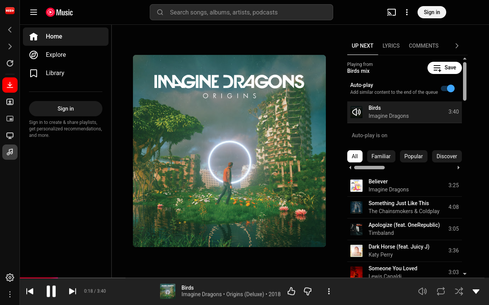

**Ctrl+M** (or the rail button) switches the window to YouTube Music. Your sign-in carries
over, and so does the video you were watching, as its track. Music keeps playing while you
browse your library, playlists and search results, and the tray, media keys and the desktop's
media controls follow along with the album name and cover. Ctrl+M switches back; Ctrl+T goes
straight to TV mode.

What changes in Music mode:

- **Ctrl+D** downloads the track that is playing, from any page, with *Audio only* preselected.
  The *Download* entry in YouTube Music's own menus (a song's three dots, the queue, the player
  bar) opens the same dialog instead of a Premium offer.
  Playlist pages download as a whole. Choosing *Video* here does not change the default the
  other modes use.
- The mini player is off (YouTube Music has its own player bar), and the screen is allowed to
  sleep while music plays.
- Links to YouTube Music from the desktop site open here instead of in a separate window, and
  `red --music` starts Red in this mode. The mode is remembered across launches like TV mode.

## Blocking

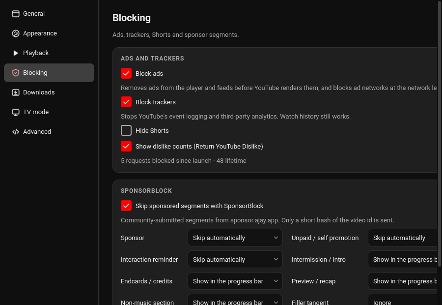

- **Block ads**: ads are removed from the player and from feeds before YouTube draws them, and
  a short list of ad and analytics hosts is blocked at the network level. Playback traffic is
  never touched, so this cannot break a video.
- **Block trackers**: stops YouTube's event logging and third-party analytics. Watch history is
  unaffected because it is part of your account, not of tracking.
- **Hide Shorts**: removes the Shorts shelf and tab on desktop and in TV mode.
- **Return YouTube Dislike**: shows dislike counts again, from the community project of the
  same name.
- **SponsorBlock**: community-submitted segments (sponsors, intros, reminders to subscribe,
  and so on). Each category can be skipped automatically, only marked on the progress bar, or
  ignored, with markers on the progress bar. The page's footer counts the requests blocked
  since launch and overall.

## Downloads

Red downloads videos, playlists and channels through a download engine that it sets up by
itself. Nothing needs installing first.

**Starting a download**

- On a video, playlist or channel page press **Ctrl+D** or the rail's download button.
- Paste a link: **Ctrl+N** (or the panel's *Paste a link…*). A link already on the clipboard
  is filled in.
- From a terminal: `red --download <link>`. Red is single-instance, so this hands the link to
  the running window.

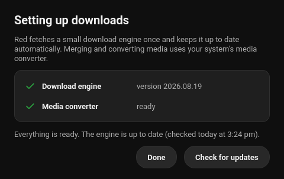

The first download fetches the engine (a few megabytes) and shows this sheet. From then on it
is checked for updates once a day; *Check for updates* here or in the Downloads panel forces a
check. Merging and converting files uses your system's media converter, which the snap and
Flatpak builds bring along.

**The download dialog**

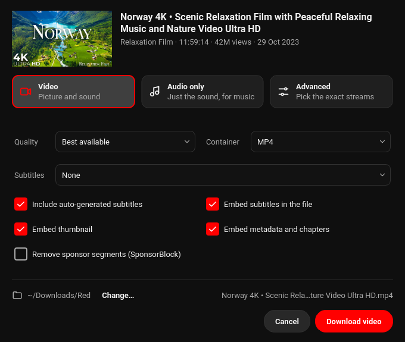

Pick what you want at the top:

- **Video**: picture and sound, at the quality and container from your defaults. You can
  change quality (up to the original resolution), container (MP4, MKV, WebM), add a subtitle
  track (auto-generated ones are marked *auto*), and embed the thumbnail, metadata and chapters.
- **Audio only**: just the sound, as the original stream or converted to MP3, M4A, Opus, FLAC
  or WAV.
- **Advanced**: the raw list of streams YouTube offers; pick one video and one audio stream, or
  a combined one.

**Remove sponsor segments** cuts the SponsorBlock segments out of the file itself. The folder
and the resulting file name are shown at the bottom; *Change…* picks another folder for this
download only.

**Playlists and channels** are detected from any link, including a video link that carries a
playlist. The dialog offers *Just this video* or *Whole playlist*, and for the whole playlist an
entry range, so a channel with a thousand videos is not fetched by accident. YouTube mixes
(auto-generated radio playlists) are treated as single videos.

**The queue**

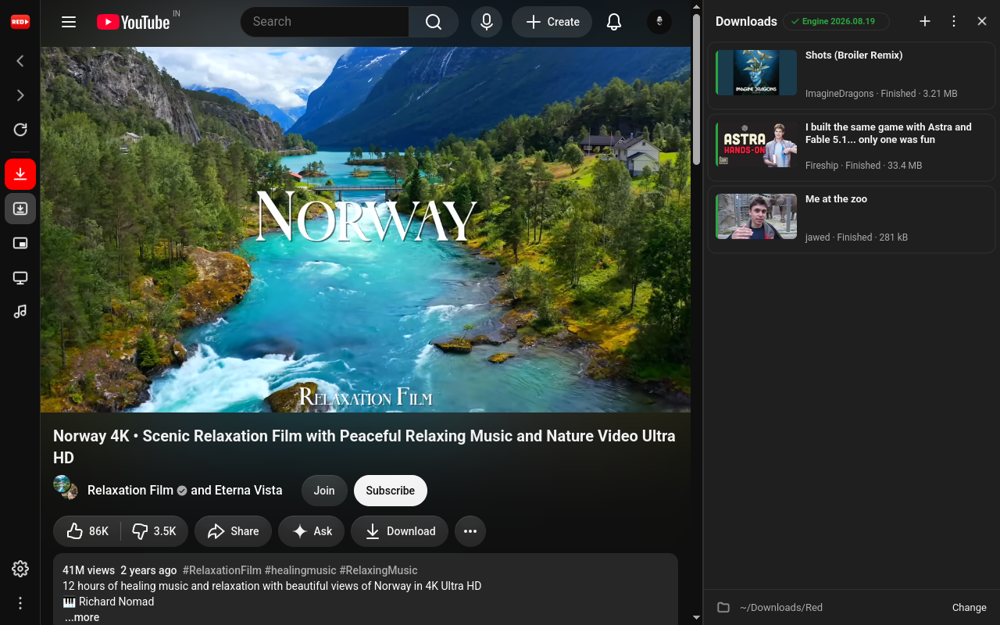

**Ctrl+J** shows the panel beside the page. Each entry has pause, resume, retry and remove;
finished entries offer *Show in folder* and *Open*. The panel's ⋯ menu pauses or resumes
everything, clears finished entries, opens the download folder and the engine sheet. A desktop
notification with *Show in folder* appears when a download finishes (switch in *Settings →
General*). The queue survives a restart; unfinished downloads can be resumed or retried.

**Age-restricted and rate-limited videos**: Red reuses your YouTube sign-in for downloads
(*Settings → Downloads → Use my YouTube sign-in for downloads*, on by default). If a download
fails with a message about signing in, sign in on the YouTube page and retry.

**Defaults** live in *Settings → Downloads*: the folder (`~/Downloads/Red` unless changed),
file name pattern, video quality, container, audio-only format, the embed and sponsor options
the dialog starts with, how many downloads run at once, and a speed limit.

**Folders**: downloads are sorted into `Videos`, `Music` (audio only), `Playlists/<playlist>`
and `Channels/<channel>` under the download folder. Turn *Sort downloads into folders* off in
*Settings → Downloads* to keep everything in one folder; playlists and channels still get a
folder of their own then.

## Settings

Press **Ctrl+,** or the rail's gear.

<table>
  <tr>
    <td width="50%">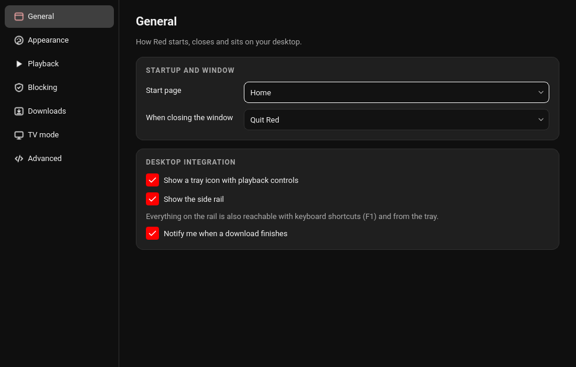</td>
    <td width="50%">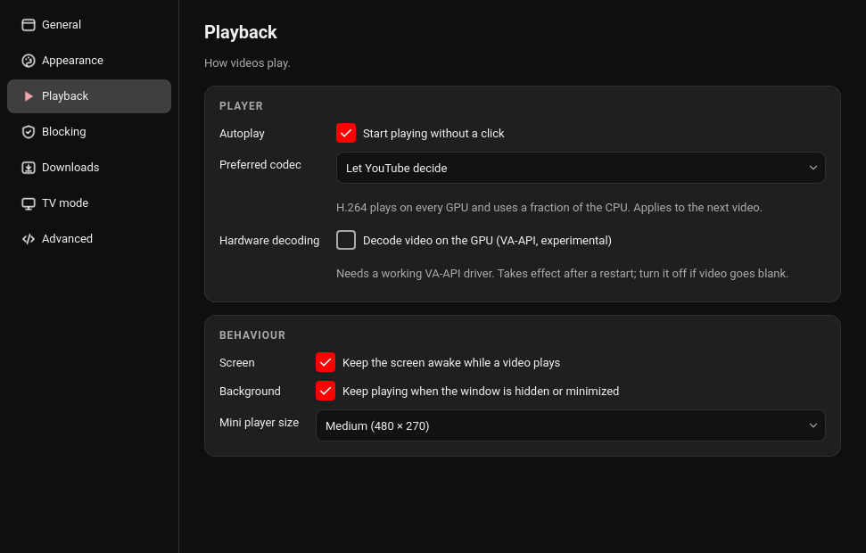</td>
  </tr>
  <tr>
    <td width="50%">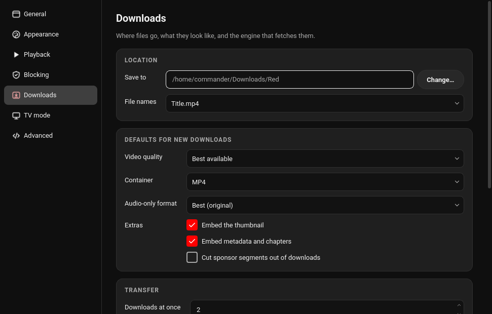</td>
    <td width="50%">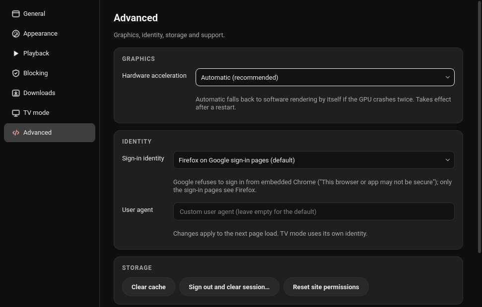</td>
  </tr>
</table>

- **General**: start page (Home, Subscriptions, or where you left off), what closing the
  window does, tray icon, side rail, download notifications.
- **Appearance**: theme, page zoom, interface scale.
- **Playback**: autoplay, preferred codec, hardware decoding, screen and background playback,
  a playback progress bar behind Red's taskbar entry (off by default; Plasma and Unity-style
  docks draw it), mini player size.
- **Blocking**: see [Blocking](#blocking).
- **Downloads**: see [Downloads](#downloads).
- **TV mode**: see [TV mode](#tv-mode).
- **Music mode** has no settings page; see [Music mode](#music-mode).
- **Advanced**: hardware acceleration, the identity used on Google's sign-in pages, a custom
  user agent, clear cache, sign out and clear the session, reset site permissions (microphone,
  camera, location), the log folder, diagnostics, and *Reset all settings* (keeps your sign-in
  and downloads).

## Keyboard shortcuts

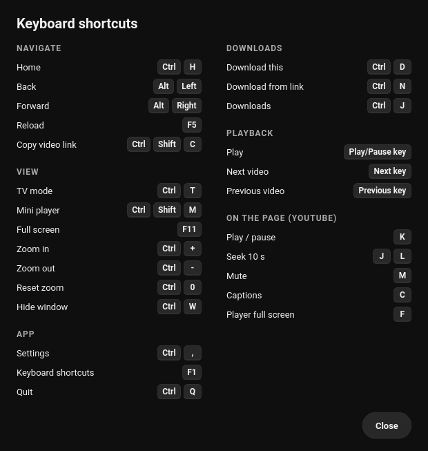

**F1** opens this sheet in the app.

| Shortcut | Action |
|---|---|
| Ctrl+H | Home |
| Alt+Left / Alt+Right | Back / Forward |
| F5, Ctrl+R | Reload |
| Ctrl+Shift+C | Copy video link |
| Ctrl+D | Download this video / playlist / channel |
| Ctrl+N | Download from a pasted link |
| Ctrl+J | Downloads panel |
| Ctrl+Shift+M | Mini player |
| Ctrl+T | TV mode |
| Ctrl+M | Music mode |
| F11 | Full screen |
| Ctrl++ / Ctrl+- / Ctrl+0 | Zoom in / out / reset |
| Ctrl+W | Hide the window (to the tray) |
| Ctrl+, | Settings |
| Ctrl+Q | Quit |
| Play/Pause, Next, Previous media keys | Playback |

YouTube's own player keys keep working while the page has focus: **K** play / pause, **J** and
**L** seek 10 s, **M** mute, **C** captions, **F** player full screen.

## Command line

```
red <youtube-link>       open the link in the running window (or start Red with it)
red --download <link>    queue a download
red --tv                 start in TV mode
red --music              start in Music mode (YouTube Music)
red --settings           open the settings
red --quit               quit the running instance
red --profile <name>     a separate profile: own sign-in, settings and downloads
```

Inside the snap the command is `red-app`; with the Flatpak it is `flatpak run com.ktechpit.red`.

## Troubleshooting

**Video is blank or black, sound plays.** Turn off *Settings → Playback → Hardware decoding*,
and if that is not enough set *Settings → Advanced → Hardware acceleration* to *Off*. Both
take effect after a restart. Red does this by itself when the GPU keeps crashing.

**Google refuses the sign-in ("This browser or app may not be secure").** Keep *Settings →
Advanced → Sign-in identity* on its default (Firefox on Google's pages). If a sign-in attempt
still loops, use *Sign out and clear session…* on the same page and sign in again.

**A download fails.** Open the Downloads panel, press *Retry* first. If it fails again open
the engine sheet (panel ⋯ → *Download engine…*) and *Check for updates*; YouTube changes often
and the engine follows within a day. A message about age restriction or rate limits means the
download needs your sign-in; see [Downloads](#downloads).

**No tray icon.** GNOME hides tray icons unless the *AppIndicator and KStatusNotifierItem
Support* extension is installed. KDE, Cinnamon, XFCE and MATE show it out of the box.

**No notifications, or the download folder cannot be chosen.** The snap and Flatpak use the
desktop's portals for both; make sure `xdg-desktop-portal` and the portal backend for your
desktop (`-gtk`, `-kde`, `-gnome`) are installed.

**Media keys do nothing.** Another player may have claimed them; pause or close it. On GNOME
the *Sound* or *Media* keys also need to be bound in the keyboard settings.

**Something else.** *About Red → Copy* puts the diagnostics (versions, GPU, engine state) on
the clipboard, and *Open log folder* in the ⋯ menu shows the log. Attach both to an
[issue](https://github.com/keshavbhatt/red/issues) or email them to
[connect@ktechpit.com](mailto:connect@ktechpit.com).

## Privacy

Red talks to YouTube the way a browser does, with your account if you sign in. Beyond that it
contacts only:

- **SponsorBlock** (sponsor.ajay.app) and **Return YouTube Dislike**, when those features are
  on. SponsorBlock receives a short hash prefix of the video id, not the id itself.
- **The download engine's official release site**, to fetch and update the engine.

Nothing about what you watch or download is sent anywhere else. Sign-in cookies stay on your
machine; for downloads they are handed to the engine in a temporary file that is deleted when
the download ends.

<sub>YouTube is a trademark of Google LLC. Red is an independent client and is not affiliated
with, endorsed by, or sponsored by YouTube or Google.</sub>
