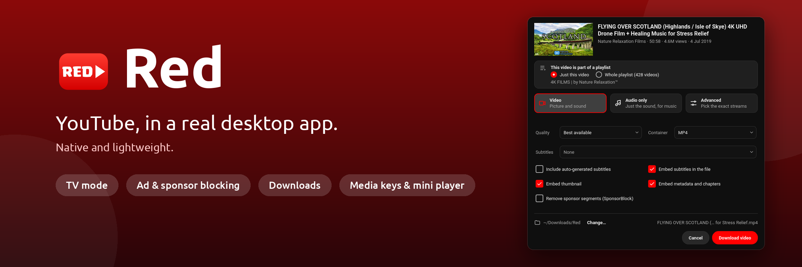
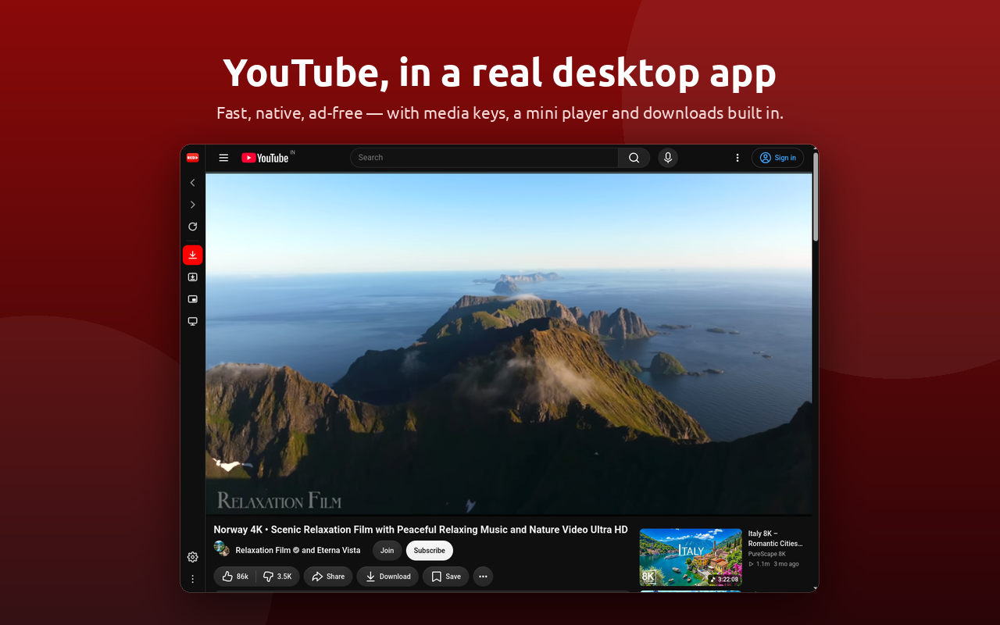
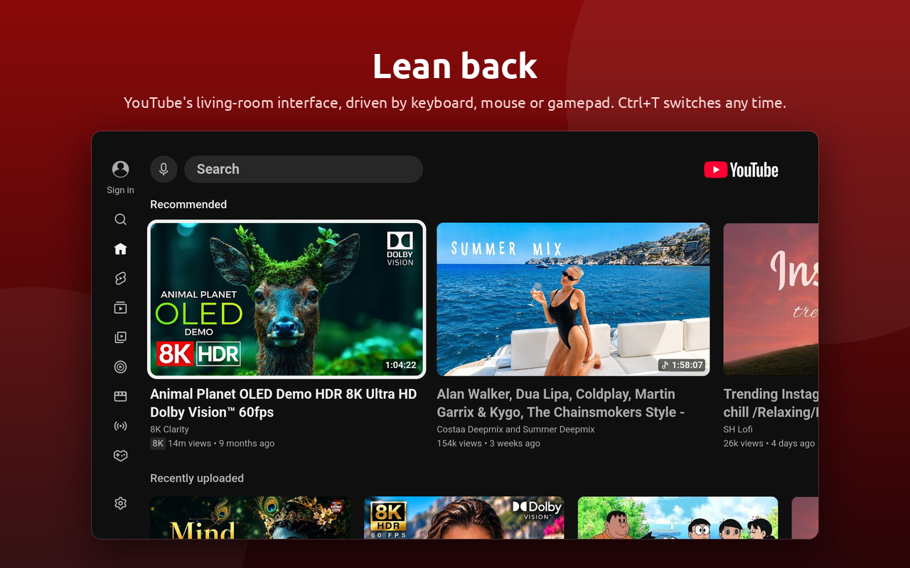
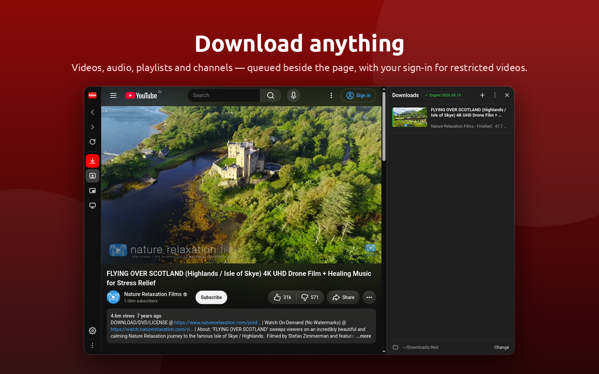
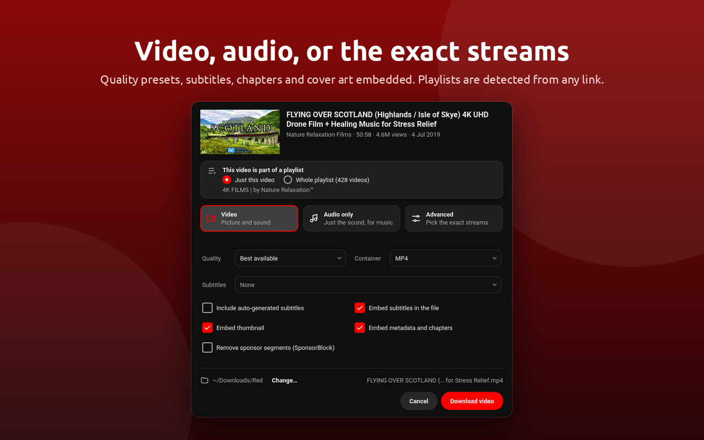
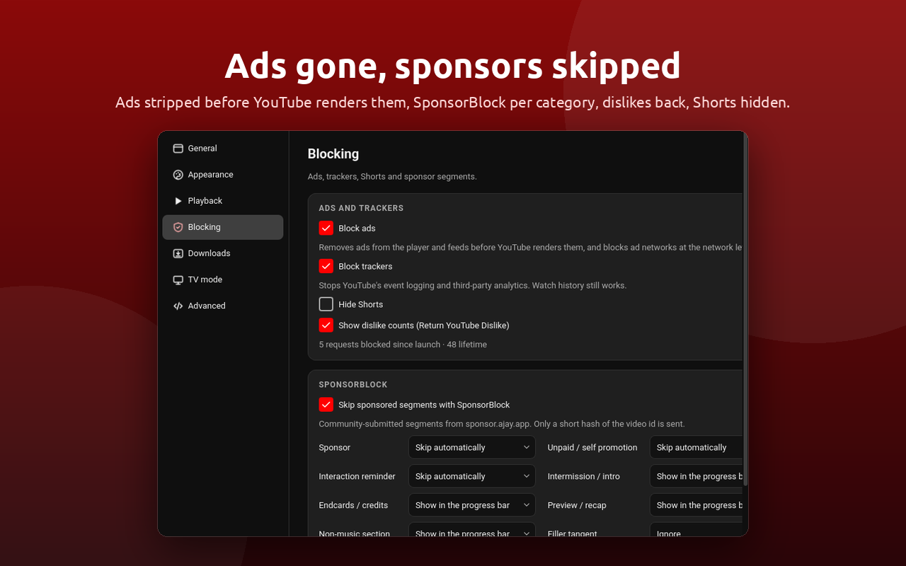

<p align="center">
  
</p>

<p align="center">
  A living-room TV mode, ad and tracker blocking, SponsorBlock, media keys, a mini player and a
  real download manager — lightweight and native, built with Qt&nbsp;6.
</p>

<p align="center">
  <a href="https://snapcraft.io/red-app"></a>
</p>

<p align="center">
  
</p>

## Install

**Snap** (amd64 and arm64):

```sh
sudo snap install red-app
```

**Flatpak**: bundles for x86_64 and aarch64 are attached to each
[release](https://github.com/keshavbhatt/red/releases); install with
`flatpak install red-x86_64.flatpak`. A Flathub listing follows.

## Features

**Two modes**
- **Desktop**: the full YouTube site, signed in, themed light / dark / system.
- **TV** (Ctrl+T): YouTube's smart-TV interface with keyboard, mouse and gamepad control,
  full screen by default.

**Blocking**
- Ads stripped from player and feed responses before YouTube renders them, plus a tiny
  network-level list for ad and analytics networks. Playback hosts are never touched.
- SponsorBlock: skip or mark eight segment categories, with progress-bar markers.
- Return YouTube Dislike, Hide Shorts.

**Downloads**
- Any video, playlist or channel — video, audio only (MP3 / M4A / Opus / FLAC / WAV) or the
  exact streams you pick — with subtitles, thumbnail, metadata and chapters embedded and
  sponsor segments cut out on request.
- Playlists are detected from any link; entries can be picked one by one.
- A queue with pause / resume / retry, notifications with *Show in folder*, and your YouTube
  sign-in reused for age-restricted or rate-limited videos.
- The download engine sets itself up on first use and keeps itself updated.

**Desktop integration**
- Media keys and desktop media controls (MPRIS), tray icon with playback controls, keeps the
  screen awake while playing, mini player (Ctrl+Shift+M), single instance with
  `red <youtube-link>` and `red --download <link>`.

## Screenshots

<table>
  <tr>
    <td width="50%"></td>
    <td width="50%"></td>
  </tr>
  <tr>
    <td width="50%"></td>
    <td width="50%"></td>
  </tr>
</table>

## About this repository

This repository is Red's public home: the README, screenshots, changelog, releases and the
issue tracker. Red is closed source; the application's code is not published here.

## Support

Bugs and requests: [issues](https://github.com/keshavbhatt/red/issues). Please attach the
diagnostics from *About Red → Copy* when reporting a problem.

## License

Red is proprietary software. Copyright © 2026 Keshav Bhatt, all rights reserved; see
[LICENSE](LICENSE).

<sub>YouTube is a trademark of Google LLC. Red is an independent client and is not affiliated
with, endorsed by, or sponsored by YouTube or Google.</sub>
